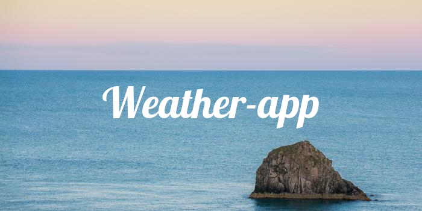

  

# Weather App

This project is a web application where users can view the weather in their desired countries of choice 

## Highlight

The app changes backgrounds upon weather data fetched from the OpenWeatherMap API

## My personal Takeways
This was my first time implementing Asynchronous programming, Particularly using ASYNC and Await functions. This was also my first project using/handling with data requests from API's and handling JSON.

## How to use

Use the Github pages environment and view the latest deployment of the project 

## Tech/ Framework Used

 
 

 

## Future Implementations
Add animations 

## Contact info
Feel free to contact me here! aaronvitharanage@gmail.com
